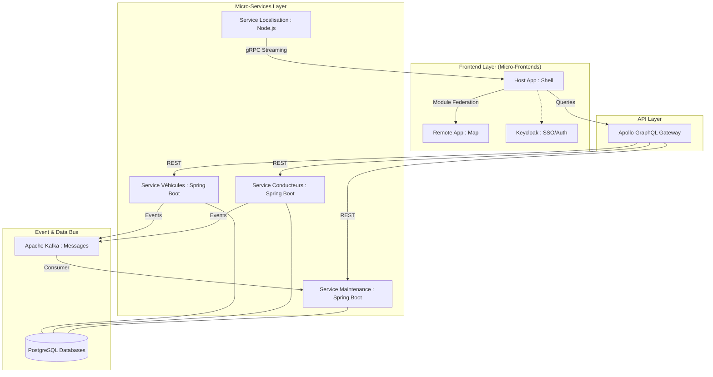

# Architecture Détaillée du Système SGFV 🏗️

Ce document présente l'organisation des composants techniques du projet.

## 📊 Diagramme de Flux (Architecture Globale)

## 🧠 Concepts Avancés Implémentés

### 1. Saga Pattern (Choréographie)
Pour garantir la cohérence des données sans transactions distribuées :
1. Le **Service Véhicules** publie un événement `VEHICULE_CREE`.
2. Le **Service Maintenance** consomme cet événement pour initialiser le planning automatiquement.

### 2. Module Federation (Micro-Frontends)
L'application Front est découpée en deux builds distincts :
- Le `mf-shell` est l'hôte (port 3000).
- Le `mf-carte` est le remote (port 3001) qui expose son propre composant de carte.

### 3. gRPC & Streaming
Utilisé pour le **Service Localisation** afin de minimiser la latence et utiliser un format binaire (Protobuf) pour les positions GPS massives.

### 5. Observabilité & Monitoring
Le système intègre une stack d'observabilité complète :
- **Prometheus** : Collecte des métriques techniques (JVM, Node.js) et business via Actuator et `prom-client`.
- **Jaeger** : Tracing distribué via OpenTelemetry pour suivre le cheminement des requêtes entre les microservices.
- **Grafana** : Dashboards personnalisés pour la visualisation en temps réel.
- **Alertmanager** : Gestion des alertes critiques (services down, latence élevée).

---
# ─────────────────────────────────────────────────
# Décisions d'Architecture (ADR)
# ─────────────────────────────────────────────────
*Projet Master SGFV 2026*
