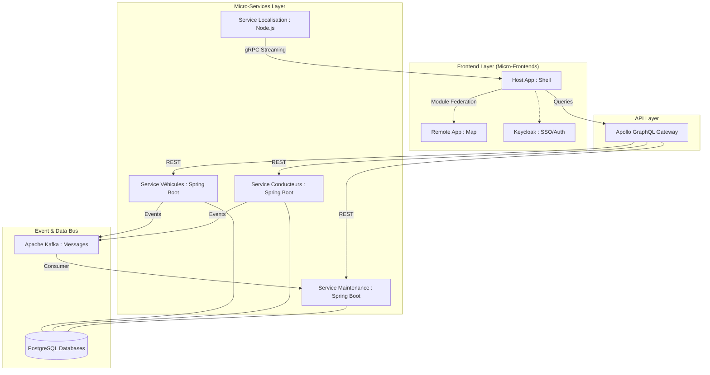

# Architecture Détaillée du Système SGFV 🏗️

Ce document présente l'organisation des composants techniques du projet.

## 📊 Diagramme de Flux (Architecture Globale)

## 🧠 Concepts Avancés Implémentés

### 1. Saga Pattern (Choréographie)
Pour garantir la cohérence des données sans transactions distribuées :
1. Le **Service Véhicules** publie un événement `VEHICULE_CREE`.
2. Le **Service Maintenance** consomme cet événement pour initialiser le planning automatiquement.

### 2. Module Federation (Micro-Frontends)
L'application Front est découpée en deux builds distincts :
- Le `mf-shell` est l'hôte (port 3000).
- Le `mf-carte` est le remote (port 3001) qui expose son propre composant de carte.

### 4. TimescaleDB (Time-Series Storage)
Pour le tracking GPS, une base PostgreSQL classique atteindrait ses limites de performance. Nous utilisons **TimescaleDB** qui permet :
- **Hypertables** : Partitionnement automatique par temps.
- **Indexation spatiale (PostGIS)** : Requêtes géographiques ultra-rapides pour le Geofencing.
- **Compression** : Réduction de l'empreinte disque pour l'historique massif.

### 5. Observabilité & Monitoring
Le système intègre une stack d'observabilité complète (Standard OpenTelemetry) :
- **Traces** : Suivi du parcours d'une requête du frontend jusqu'à la base de données via **Jaeger**.
- **Métriques** : Collecte des indicateurs de santé (latence, erreurs, CPU) via **Prometheus**.
- **Visualisation** : Dashboards **Grafana** pour une vue d'ensemble en temps réel.
- **Logs** : Agrégation centralisée pour faciliter le debugging distribué.

---

## 🛠️ Schéma de Données (Concepts)

1. **Véhicules** : Stockage relationnel (PostgreSQL).
2. **Positions** : Séries temporelles (TimescaleDB).
3. **Alertes** : Stockage persistant des événements Kafka critiques.

---

# ─────────────────────────────────────────────────
# Décisions d'Architecture (ADR)
# ─────────────────────────────────────────────────
*Retrouvez le détail des choix techniques dans le dossier `/docs/adr/`.*
