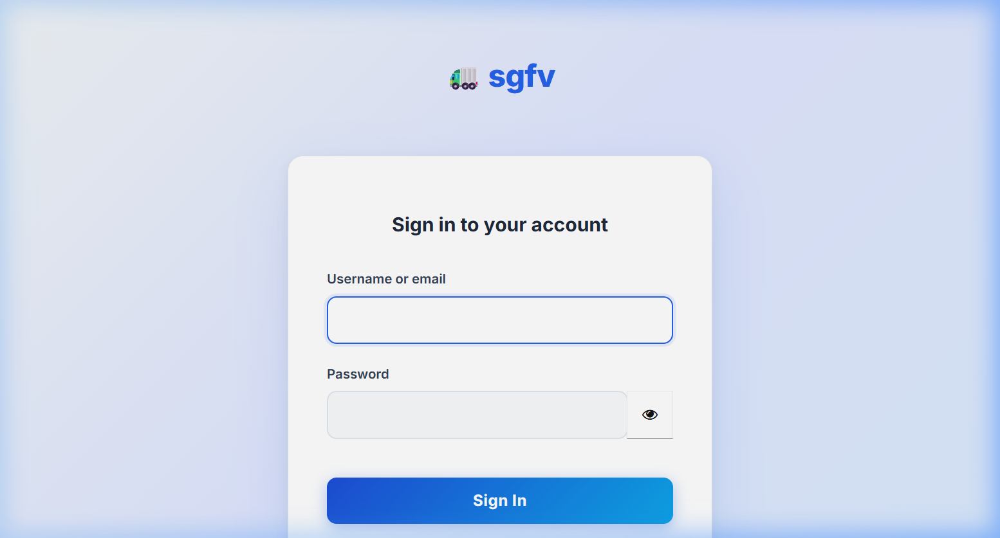

# Guide de Lancement du Projet SGFV 🚀

Le projet est maintenant opérationnel. Voici les étapes pour le lancer et les explications sur les problèmes rencontrés.

## 🛠️ État Actuel du Système
- **Infrastructure (Docker)** : ✅ Tous les services sont démarrés (Keycloak, Gateway, Postgres, Kafka, etc.)
- **Front-End (Vite)** : ✅ Lancé sur [http://localhost:3005](http://localhost:3005)

## 📝 Pourquoi "localhost" ne marchait pas ?

1. **Conflit de Port (Grafana vs Front-End)** :
   - Le `README.md` indiquait le port `3000` pour le front-end.
   - Cependant, le fichier `docker-compose.yml` utilise déjà le port `3000` pour **Grafana**.
   - Le front-end est configuré dans `vite.config.js` pour utiliser le port **3005**.

2. **Erreur de Montage Keycloak** :
   - Le conteneur Keycloak était arrêté suite à une erreur de montage de fichier (`realm-export.json`). Cela arrive parfois sur Windows quand le chemin contient des caractères spéciaux ou des parenthèses. Une réinitialisation via `docker-compose up -d` a corrigé le problème.

3. **Front-End non démarré** :
   - Les services backend tournent dans Docker, mais le front-end (Vite) doit être lancé manuellement.

## 🚀 Comment lancer le projet à l'avenir ?

### 1. Démarrer le Back-End (Docker)
Ouvrez un terminal à la racine du projet et lancez :
```powershell
docker-compose up -d
```

### 2. Démarrer le Front-End (Vite)
Ouvrez un autre terminal dans le dossier du front-end :
```powershell
cd frontend-v2/mf-shell
npm run dev
```

### 3. Accéder aux services
- **Application SGFV** : [http://localhost:3005](http://localhost:3005) (Identifiants : `admin` / `admin123`)
- **Keycloak (Admin)** : [http://localhost:8180](http://localhost:8180)
- **Grafana (Monitoring)** : [http://localhost:3000](http://localhost:3000)
- **API Gateway (GraphQL)** : [http://localhost:4000](http://localhost:4000)
- **Kafka UI** : [http://localhost:8090](http://localhost:8090)

---

## 🔐 Configuration Keycloak (SGFV)

Le fichier `realm-export.json` a été mis à jour pour inclure automatiquement le client **sgfv_public** et tous les utilisateurs pré-configurés.

### Pour les nouveaux déploiements
L'importation se fait automatiquement au premier lancement de `docker-compose up -d`.

### Pour les déploiements existants
Si vous avez déjà lancé le projet et que le client `sgfv_public` est manquant, vous devez forcer une réimportation en supprimant le volume de la base de données Keycloak :

```powershell
# Arrêter les conteneurs et supprimer les volumes Keycloak
docker-compose down -v

# Relancer le projet (ceci réimportera le fichier realm-export.json mis à jour)
docker-compose up -d
```

---

## ✅ Preuve de fonctionnement
Voici la page de connexion Keycloak obtenue en accédant à [http://localhost:3005](http://localhost:3005) :


